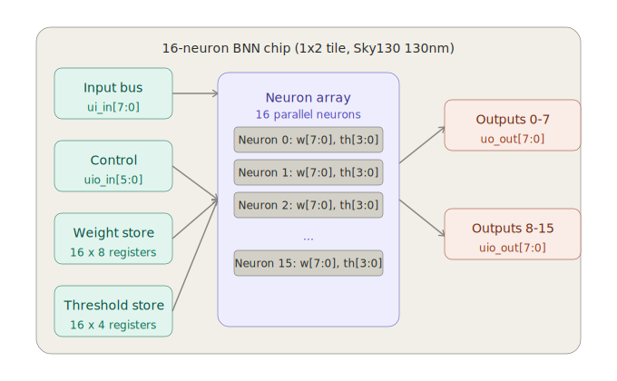

# Systolic Binary Neural Network Accelerator

## What is this chip?

This chip implements a **16-neuron Binary Neural Network (BNN) inference accelerator** in silicon. It classifies an 8-bit input vector using 16 independently programmable neurons, each with learnable binary weights and a signed bias. The design is inspired by the systolic array architecture invented by H.T. Kung at Carnegie Mellon University in 1978, and implements the XNOR-popcount computation that is the standard in modern BNN research.



## How it works

Each neuron computes a dot product between its weight vector and a set of derived input features, then fires if the result exceeds a learned bias:

```
feat    = feature_expand(ui_in)
S[n]    = popcount( XNOR( weights[n], feat ) )
y[n]    = 1   if   S[n] + bias[n] >= 0
y[n]    = 0   otherwise
```

The compute engine processes one bit per clock cycle over 8 cycles (systolic), reusing hardware rather than duplicating it 16 times. This reduces silicon area significantly compared to a fully parallel design.

See the detailed documentation:
- [Version 1 — Parallel 16-neuron perceptron](info_v1.md)
- [Version 2 — Systolic BNN accelerator with upgrade history](info_v2.md)

## Pin mapping

| Pin | Direction | Function |
|-----|-----------|----------|
| `clk` | in | System clock |
| `rst_n` | in | Active-low reset |
| `ui_in[7:0]` | in | Input features (infer) or load data (load) |
| `uio_in[0]` | in | Mode: 0=load, 1=infer |
| `uio_in[1]` | in | Target: 0=weights, 1=bias |
| `uio_in[5:2]` | in | Neuron select 0–15 |
| `uo_out[7:0]` | out | Fire signals neurons 0–7 |
| `uio_out[7:0]` | out | Fire signals neurons 8–15 |

## How to test

### Load weights for neuron n
1. Set `uio_in[0]=0`, `uio_in[1]=0`, `uio_in[5:2]=n`
2. Set `ui_in[7:0]` = 8-bit weight pattern
3. Pulse clock

### Load bias for neuron n
1. Set `uio_in[0]=0`, `uio_in[1]=1`, `uio_in[5:2]=n`
2. Set `ui_in[3:0]` = bias magnitude, `ui_in[4]` = sign (1=negative)
3. Pulse clock

### Run inference
1. Set `uio_in[0]=1`
2. Set `ui_in[7:0]` = input feature vector
3. After 8 clock cycles read `uo_out` and `uio_out`

### Train weights in Python
```python
from perceptron_trainer import train_perceptron, generate_load_instructions
import numpy as np

X = np.random.randint(0, 2, (200, 8))
y = (X.sum(axis=1) > 4).astype(int)
weights, bias, _ = train_perceptron(X, y, epochs=100)
generate_load_instructions(weights, bias)
```

## External hardware

No external hardware required. A Raspberry Pi or Arduino can load trained weights and run inference via the `ui_in` and `uio_in` pins. See [info_v2.md](info_v2.md) for full Raspberry Pi wiring and Python code.
