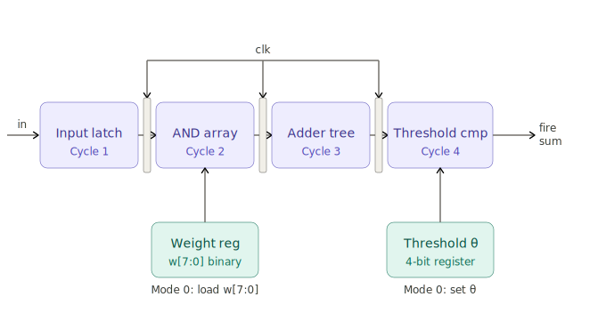

# 4-Stage Pipelined Binary Perceptron

## How it works

This project implements a **binary perceptron** — the fundamental building block
of all neural networks — as a 4-stage pipelined digital circuit on a Tiny Tapeout
tile. It classifies an 8-bit input vector every clock cycle after an initial 4-cycle
warmup latency.

### The Perceptron Model

The perceptron computes a weighted sum of binary inputs and compares it to a
threshold to produce a binary classification:

    y = 1  if  S(wi . xi) >= theta
    y = 0  otherwise

Where:
- xi are the 8 input feature bits (0 or 1)
- wi are the 8 stored binary weights (0 or 1)
- theta is the 4-bit programmable threshold
- y is the classification output (fire signal)

Since all values are binary, multiplication reduces to a logical AND:

    wi . xi = wi AND xi

The weighted sum counts how many input bits are both present AND
considered important by their weight:

    S = S(wi AND xi)  for i = 0..7,  S in {0,1,...,8}

### The journey of a signal through the four stages

**Stage 1 - Input latch**
The 8 input bits arrive on the pins (imagine 8 tiny switches: on or off).
On the rising clock edge they are frozen into flip-flops so the rest of the
circuit has a stable snapshot to work with.

**Stage 2 - AND array**
Each frozen input bit is multiplied by its corresponding weight bit.
Because everything is binary (0 or 1), multiplication is just an AND gate —
the simplest possible gate on silicon. Eight AND gates fire in parallel,
each asking "is this feature both present in the input AND considered
important by the weight?"

**Stage 3 - Adder tree**
The eight 0/1 results from stage 2 are added together using a tree of
half-adders arranged in 3 levels. This produces a single 4-bit number
between 0 and 8 — the weighted vote count, exactly like tallying up how
many committee members said yes.

Each half-adder computes:
    sum   = A XOR B
    carry = A AND B

**Stage 4 - Threshold comparator**
The vote count is compared to a programmable threshold theta.
If sum >= theta, the neuron fires (fire = 1).
If not, it stays silent (fire = 0).
This is the actual classification decision — a single bit that says yes or no.

### Why is this genuinely AI?

This is the McCulloch-Pitts neuron — the 1943 mathematical model that started
the entire field of neural networks. Every modern AI model, from GPT to image
classifiers, is built from billions of these exact computations. This project
implements the fundamental atom of machine intelligence directly in silicon,
with no CPU, no software, no operating system — just logic gates switching
at the speed of electrons.

### Why is the pipeline the ambitious part?

Without the pipeline, the circuit would need to finish all four stages within
a single clock cycle — meaning the clock speed is bottlenecked by the slowest
stage (the adder tree). With the pipeline registers between each stage, four
different input samples are processed simultaneously:

    Cycle 1:  Sample A -> Stage 1
    Cycle 2:  Sample A -> Stage 2,  Sample B -> Stage 1
    Cycle 3:  Sample A -> Stage 3,  Sample B -> Stage 2,  Sample C -> Stage 1
    Cycle 4:  Sample A -> Stage 4,  Sample B -> Stage 3,  Sample C -> Stage 2,  Sample D -> Stage 1
    Cycle 5:  Result A out!         Sample B -> Stage 4,  ...

After the initial 4-cycle warmup, a new classification result is produced
on every single clock tick.

### Pipeline Architecture Diagram

## Pin Mapping

| Pin | Direction | Function |
|-----|-----------|----------|
| clk | in | System clock |
| rst_n | in | Active-low reset |
| ui_in[7:0] | in | Input features or load data |
| uio[0] | in | Mode: 0 = load weights, 1 = infer |
| uo_out[7] | out | fire - classification result |
| uo_out[3:0] | out | sum[3:0] - raw weighted sum |

## How to test

### Step 1 - Load weights
Set ui_in[7:0] to desired weight pattern. Clock once to latch into weight registers.
Example: 11111111 means all features are equally important.

### Step 2 - Load threshold
Set ui_in[3:0] to desired threshold value. Clock once to latch.
Example: 00000100 sets theta = 4, meaning at least 4 features must match.

### Step 3 - Run inference
Set ui_in[7:0] to the input feature vector.
After 4 clock cycles, uo_out[7] reflects the classification:
- fire = 1 means input pattern matches (S >= theta)
- fire = 0 means input pattern does not match (S < theta)

### Example

With weights = 11111111 and threshold theta = 4:
- Input 11111111 gives S = 8, 8 >= 4, fire = 1
- Input 11100000 gives S = 3, 3 < 4,  fire = 0
- Input 11110000 gives S = 4, 4 >= 4, fire = 1

## External hardware

No external hardware required.
