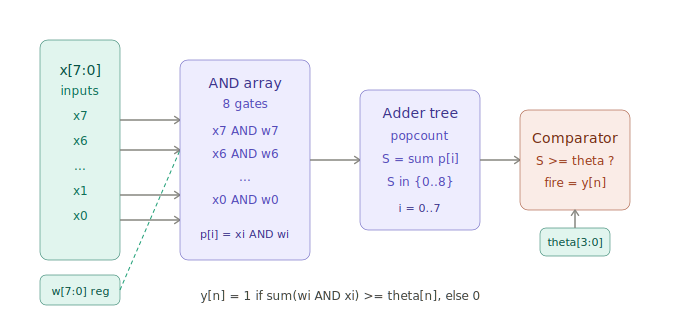

# Version 1 — 16-Neuron Binary Neural Network

## Overview

Version 1 implements 16 binary perceptron neurons arranged in a parallel inference layer. All 16 neurons process the same 8-bit input simultaneously, each with its own 8-bit weight register and 4-bit threshold, producing a 16-bit output vector in a single clock cycle.

## Architecture


### The mathematical model

Each neuron `n` computes:

```
S[n] = sum( w[n][i] AND x[i] )   for i = 0..7
y[n] = 1   if   S[n] >= theta[n]
y[n] = 0   otherwise

where:
  x[i]      in {0,1}   input feature bit i
  w[n][i]   in {0,1}   stored weight for neuron n bit i
  theta[n]  in {0..8}  4-bit threshold
  y[n]                 fire signal
```

### Inside a single neuron



**Stage 1 — AND array**
```
p[i] = x[i] AND w[n][i]   for i = 0..7
```
Eight AND gates fire in parallel. Because weights are binary, AND is the correct multiply.

**Stage 2 — Adder tree**
```
S[n] = p[0] + p[1] + p[2] + p[3] + p[4] + p[5] + p[6] + p[7]
```
The 8 product bits are summed into a 4-bit count between 0 and 8.

**Stage 3 — Threshold comparator**
```
y[n] = 1   if   S[n] >= theta[n]
```
Fully combinational — result available within one clock cycle.

### Why 16 neurons in parallel?

All 16 neurons share the same input bus and compute simultaneously. Each answers a different yes/no question about the input in a single clock cycle.

### Why is this AI?

This implements the McCulloch-Pitts neuron (1943) — the mathematical model that founded neural networks. Every modern AI system is built from billions of this computation.

---

## Pin mapping

| Pin | Direction | Function |
|-----|-----------|----------|
| `clk` | in | System clock |
| `rst_n` | in | Active-low reset |
| `ui_in[7:0]` | in | Input features (infer) or load data (load) |
| `uio_in[0]` | in | Mode: 0=load, 1=infer |
| `uio_in[1]` | in | Target: 0=weights, 1=thresholds |
| `uio_in[5:2]` | in | Neuron select 0–15 |
| `uo_out[7:0]` | out | Fire signals neurons 0–7 |
| `uio_out[7:0]` | out | Fire signals neurons 8–15 |

---

## How to test

### Step 1 — Reset
Assert rst_n low then high. All weights clear to 0, thresholds reset to 4.

### Step 2 — Load weights
For each neuron n (0–15):
1. Set `uio_in[0]=0`, `uio_in[1]=0`, `uio_in[5:2]=n`
2. Set `ui_in[7:0]` = weight pattern
3. Pulse clock

### Step 3 — Load thresholds
For each neuron n (0–15):
1. Set `uio_in[0]=0`, `uio_in[1]=1`, `uio_in[5:2]=n`
2. Set `ui_in[3:0]` = threshold value (0–8)
3. Pulse clock

### Step 4 — Inference
1. Set `uio_in[0]=1`
2. Set `ui_in[7:0]` = input vector
3. Read `uo_out` and `uio_out` on the next clock cycle

### Example
```
weights[0]    = 0b11111111
thresholds[0] = 5

Input 0b11111100  S=6  6>=5  uo_out[0]=1  fires
Input 0b11110000  S=4  4<5   uo_out[0]=0  silent
```

### Python training
```python
from perceptron_trainer import train_perceptron, generate_load_instructions
import numpy as np

X = np.random.randint(0, 2, (200, 8))
y = (X.sum(axis=1) > 4).astype(int)
weights, threshold, _ = train_perceptron(X, y, epochs=100)
generate_load_instructions(weights, threshold)
```

---

## Limitations leading to Version 2

Version 1 works correctly but has three weaknesses:

1. **AND not XNOR** — AND only counts active matching features. A weight of 0 is meaningless regardless of the input. XNOR counts all matching bits, including 0-0 matches, which is the standard BNN computation.

2. **Hardware duplication** — each of the 16 neurons has its own AND array, adder tree and comparator. The compute logic is replicated 16 times rather than shared.

3. **Linear chain adder** — the popcount uses a sequential addition chain rather than a balanced tree, creating a long timing path.

Version 2 addresses all three. See [info_v2.md](info_v2.md) for the full upgrade documentation.

---

## External hardware

No external hardware required. A microcontroller can load weights programmatically via the `ui_in` and `uio_in` pins.
